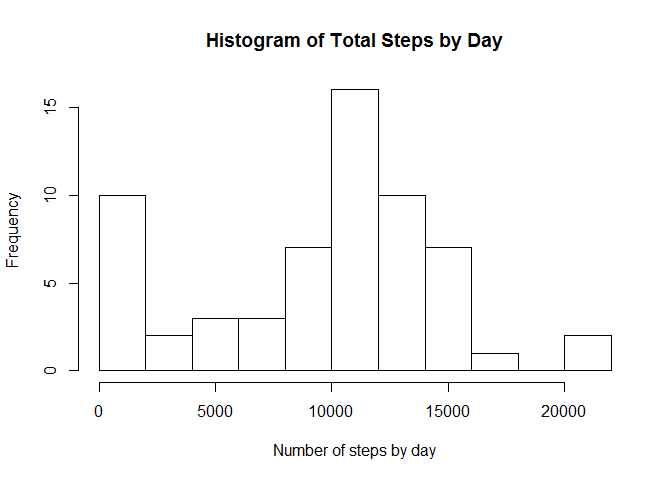
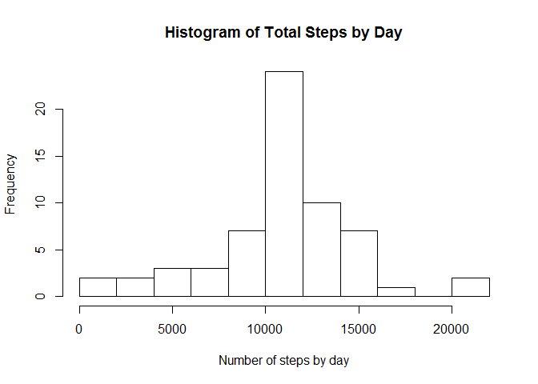
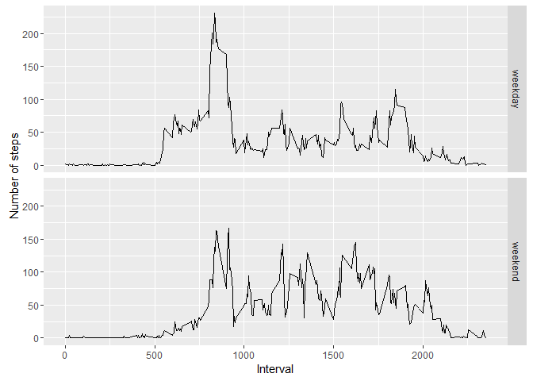

# Reproducible Research - Course Project 1
Cristobal Gallegos S.  
July 12, 2016  


# Introduction

This is my RMarkdown report for Reproducile research, course project 1. Throughout the document some data on activity motirization will be read, process and analysed.


### Activity 0: Downloading and reading the data


```r
download.file("https://d396qusza40orc.cloudfront.net/repdata%2Fdata%2Factivity.zip", "ActMonData.zip")
unzip("ActMonData.zip")
AMD <- read.csv("activity.csv")
```

### Activity 1: What is mean total number of steps taken per day?


```r
stepsBYday <- aggregate(AMD$steps, list(AMD$date), sum, na.rm = TRUE)
names(stepsBYday) <- c("Day", "Total_steps")
hist(stepsBYday$Total_steps, breaks = 10, main = "Histogram of Total Steps by Day", xlab = "Number of steps by day")
```

<!-- -->

The mean of the total number of steps taken per day is 9354.2295082 and the median is 10395.

### Activity 2: What is the average daily activity pattern?


```r
meanSteps <- aggregate(AMD$steps, list(AMD$interval), mean, na.rm = TRUE)
names(meanSteps) <- c("interval", "mean_steps")
plot(meanSteps$interval, meanSteps$mean_steps, type = "l", ylab = "Mean number of steps", xlab = "Interval")
```

<!-- -->

```r
maxIn <- meanSteps$mean_steps == max(meanSteps$mean_steps)
```

The 5-minute interval which contains the maximun number of steps, average across all the days in the dataset is 835.

### Activity 3: Imputing missing values

The total number of missing values in the data set is 2304. They will be imputed with the mean number of steps on each interval.


```r
fAMD <- AMD
for(i in which(is.na(AMD[ , 1]))){
  fAMD[i, 1] <- mean(fAMD[fAMD[ , 3] == fAMD[i, 3], 1], na.rm = TRUE)
}

fstepsBYday <- aggregate(fAMD$steps, list(fAMD$date), sum, na.rm = TRUE)
names(fstepsBYday) <- c("Day", "Total_steps")
hist(fstepsBYday$Total_steps, breaks = 10, main = "Histogram of Total Steps by Day", xlab = "Number of steps by day")
```

<!-- -->

The mean of the total number of steps taken per day after imputting missing values is 1.0766189\times 10^{4} and the median is 1.0766189\times 10^{4}.

### Activity 4: Are there differences in activity patterns between weekdays and weekends?


```r
dates <- as.Date(fAMD$date)
wdays <- weekdays(dates)

for(i in 1:17568){
  if(wdays[i] == "Saturday" | wdays[i] == "Sunday"){
    wdays[i] <- "weekend"
  } else {
    wdays[i] <- "weekday"
  }
}

fAMD$day <- wdays

daySteps <- aggregate(fAMD$steps, list(fAMD$interval, fAMD$day), mean)
names(daySteps) <- c("interval", "day", "mean_steps")
library(ggplot2)
```

```
## Warning: package 'ggplot2' was built under R version 3.2.5
```

```r
gplot <- ggplot(daySteps, aes(x = interval, y = mean_steps))
gplot + 
  facet_grid(day~.) + 
  geom_line() + 
  ylab("Number of steps") +
  xlab("Interval")
```

<!-- -->

